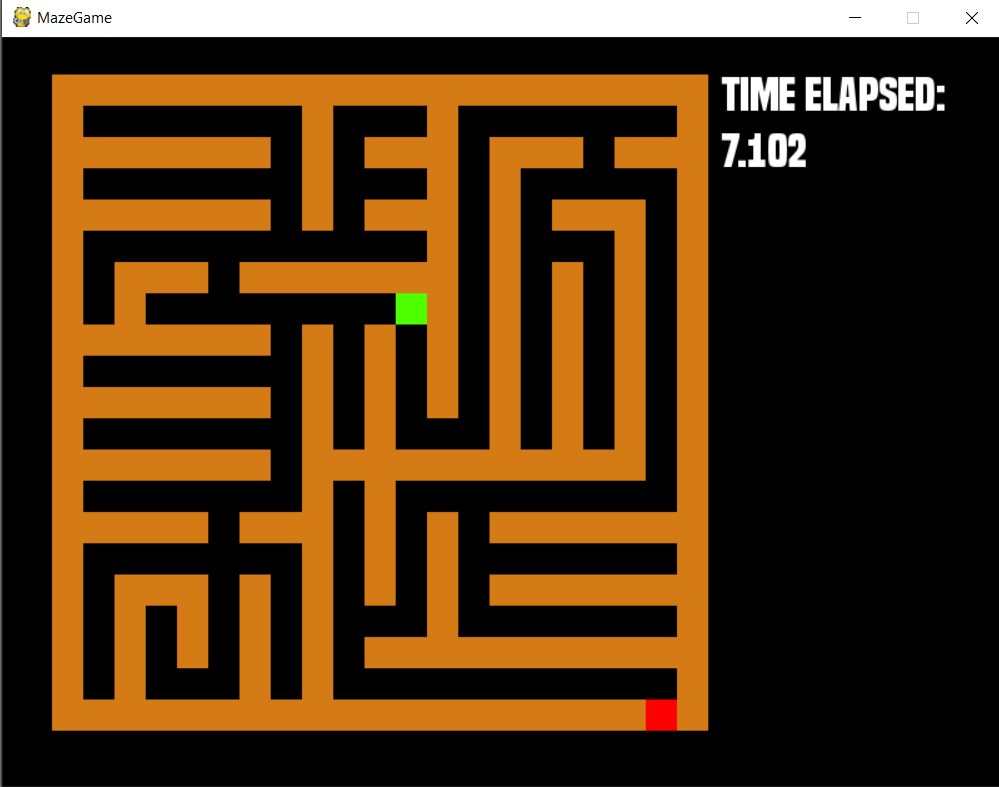
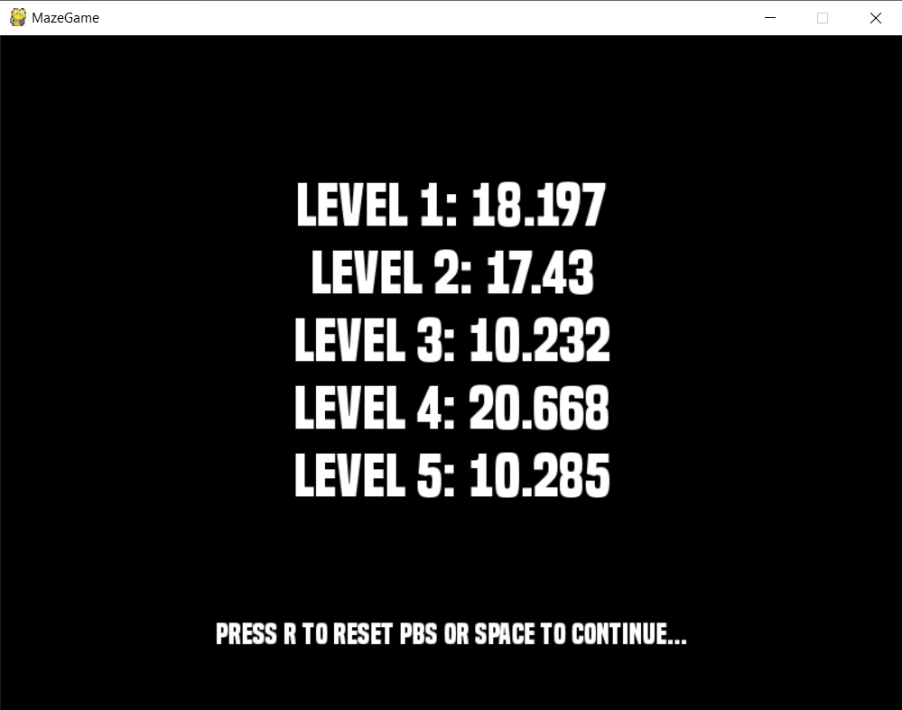
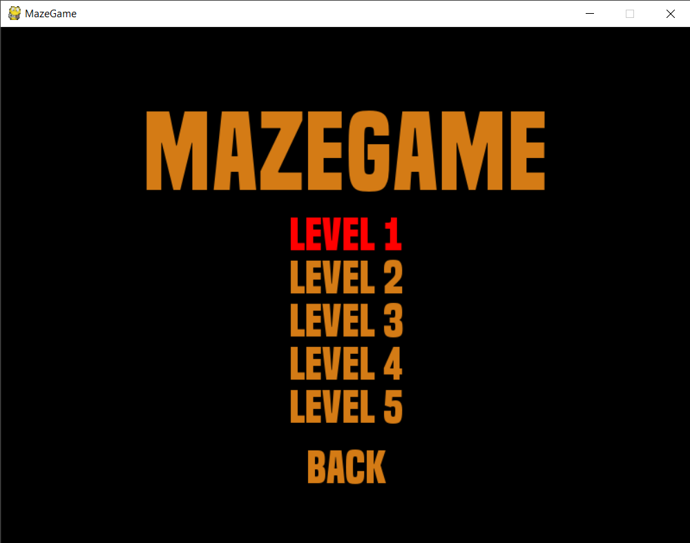

# Generování a procházení bludiště

Tento program v jazyce Python generuje bludiště, která následně umožní uživateli kompetitivní formou projít.

Pomocí prvního programu [Level_generator.py](Zapoctovy_program/Level_generator.py) bylo vygenerováno několik základních bludišť (levelů), které jsou uložené v adresáři [levels](Zapoctovy_program/levels) v jednotlivých souborech. Podstatná část tohoto programu byla také implementována do hlavního programu jako funkce, pomocí které se vygeneruje náhodné bludiště. S tímto programem může uživatel interagovat, pokud chce některý z levelů přegenerovat. 

Druhý program [main.py](Zapoctovy_program/main.py) je hra samotná, která umožní zahájit procházení předem vytvořených pěti levelů na čas. Zároveň si v hlavním programu může uživatel projít náhodně generované bludiště nebo si prohlédnout nejlepší časy z jednotlivých kol, popřípadě je resetovat. Tento program je interaktivní.

S hlavním programem uživatel komunikuje pomocí klávesnice. Jedná se především o pohyb v rámci menu a poté pohyb bludištěm. 

Na hru jako takovou je použita knihovna pygame.

## Použití

Pro spuštění hlavního programu spusťte [main.py](Zapoctovy_program/main.py). Jako první se zobrazí hlavní menu.

Vykreslení hlavního menu v kódu:

```python
def menu(choice): #menu hry, choice = cislo vyberu z menu
    ...
    
    vybrana_barva = (255,0,0) #cervena
    normalni_barva = (212,123,21) #oranzova
    
    if choice == 1:
        barva_v1 = vybrana_barva
        barva_v2 = barva_v3 = barva_v4 = normalni_barva
    elif choice == 2:
        barva_v2 = vybrana_barva
        barva_v1 = barva_v3 = barva_v4 = normalni_barva
    elif choice == 3:
        barva_v3 = vybrana_barva
        barva_v1 = barva_v2 = barva_v4 = normalni_barva
    else:
        barva_v4 = vybrana_barva
        barva_v2 = barva_v3 = barva_v1 = normalni_barva
        
    font_nadpis = pygame.font.Font("font/built_titling_bd.otf", 120)
    text_nadpis = font_nadpis.render('MazeGame',True,(212,123,21))
    textRect_n = text_nadpis.get_rect()
    textRect_n.center = (800 // 2, 600 // 2 - 155)
    
    font_volba = pygame.font.Font("font/built_titling_bd.otf", 70)
    text_volba1 = font_volba.render('normal game',True,barva_v1)
    textRect_v1 = text_volba1.get_rect()
    textRect_v1.center = (800 // 2, 600 // 2 - 40)
    
    text_volba2 = font_volba.render('random game',True,barva_v2)
    textRect_v2 = text_volba2.get_rect()
    textRect_v2.center = (800 // 2, 600 // 2 + 30)
    
    text_volba3 = font_volba.render('personal bests',True,barva_v3)
    textRect_v3 = text_volba3.get_rect()
    textRect_v3.center = (800 // 2, 600 // 2 + 100)
    
    text_volba4 = font_volba.render('exit',True,barva_v4)
    textRect_v4 = text_volba4.get_rect()
    textRect_v4.center = (800 // 2, 600 // 2 + 170)
    ...
        win.fill((0,0,0))
        win.blit(text_nadpis, textRect_n)
        win.blit(text_volba1, textRect_v1)
        win.blit(text_volba2, textRect_v2)
        win.blit(text_volba3, textRect_v3)
        win.blit(text_volba4, textRect_v4)
        pygame.display.update()
        ...
    ...

```

Výsledek:


Pro přegenerování některého z levelu spusťte [Level_generator.py](Zapoctovy_program/Level_generator.py). Do konzole zadejte celé číslo od 1 do 5 podle čísla levelu, který se má přegenerovat. Zadání jiného čísla nebo znaku způsobí vytvoření nového textového souboru, který se ovšem v hlavní hře neprojeví.

Uložení nově vygenerovaného bludiště v kódu:
```python
def uloz_bludiste(num):
    f = open(f"levels/level{num}.txt","wt")
    for radek in bludiste:
        for prvek in radek:    
            f.write(f"{prvek}")
        f.write("\n")
    f.close()
```

Výsledek uloženého bludiště v textovém souboru (pro zadané číslo 4):  


## Instalace a požadavky
Pro spuštění [main.py](Zapoctovy_program/main.py) je potřeba mít nainstalovanou knihovnu Pygame verze 1.9.6, pro spuštění [Level_generator.py](Zapoctovy_program/Level_generator.py) není třeba žádná nainstalovaná knihovna.

## Dokumentace

### Použité knihovny
Pro program jsem použil několik knihoven, bez kterých by funkčnost programu nebyla vůbec možná. Jedná se o:

* **Pygame** - umožňuje snadnou tvorbu hry,
* **Random** - díky knihovně Random jsou vybírány náhodné základy a náhodné směry při generování bludiště (popsáno níže),
* **Os** - umožňuje ukončení hry.

### Algoritmus použitý pro generování bludiště
Algoritmus, pomocí kterého se bludiště generuje, jsem zvolil tak, aby byl co nejpřehlednější a co nejlépe implementovatelný. Jedná se o algoritmus, který je popsaný v článku na webu [itnetwork.cz](https://www.itnetwork.cz/navrh/algoritmy/algoritmy-bludiste/algoritmus-tvorba-nahodneho-bludiste). Pro realizaci algoritmu budeme potřebovat reprezentovat 3 stavy políčka - nic = 0, základ = 1, zeď = 2. Na základě těchto hodnot pak vytvoříme základ pro tvorbu bludiště - okraje mají hodnotu 2, každé sudé políčko na sudém řádku (číslujeme od 0), kde není okraj, má hodnotu 1, ostatní políčka mají hodnotu 0.

Stručně nastíněný algoritmus:
1. náhodně vybereme jeden ze základů (hodnota 1)
2. vybereme náhodně směr a od vybraného základu daným směrem stavíme zeď, dokud nenarazíme na jinou zeď (hodnota 2)
3. celý algoritmus opakujeme, dokud počet základů není 0  

  
Na animaci jsou zdi reprezentovány šedivými políčky, základy políčky s křížkem a volná políčka bílou barvou. Obrázky, ze kterých je vytvořená animace, jsou opět z webu [itnetwork.cz](https://www.itnetwork.cz/navrh/algoritmy/algoritmy-bludiste/algoritmus-tvorba-nahodneho-bludiste).

Implementace algoritmu v programu [main.py](Zapoctovy_program/main.py):
```python
def gen_maze(): #funkce generovani bludiste
    bludiste = []

    def template(): #0 = zed, 1 = zaklad, 2 = volno; vytvori planek pro tvorbu bludiste
        bludiste.append([0 for _ in range(21)])
        bludiste.append([0]+[2 for _ in range(19)]+[0])
        for _ in range(9):
            bludiste.append([0,2]+[ x for _ in range(9) for x in (1,2)]+[0])
            bludiste.append([0]+[2 for _ in range(19)]+[0])
        bludiste.append([0 for _ in range(21)])

    def uloz_bludiste():
        f = open("levels/random_level.txt","wt")
        for radek in bludiste:
            for prvek in radek:    
                f.write(f"{prvek}")
            f.write("\n")
        f.close()
     
    def kolik_zakladu(): #spocita, kolik je v planku zbylych zakladu
        pocet_zakladu = 0
        for radek in bludiste:
            for prvek in radek:
                if prvek == 1:
                    pocet_zakladu +=1
                else: pass
        return pocet_zakladu

    def vyber_nahodne_zaklad(): #nahodne vybere jeden ze zakladu
        poc_zakladu = 0
        poc_radku = 0
        index = random.randint(1,kolik_zakladu())
        #print(index)
        for radek in bludiste:
            poc_prvku = 0
            while poc_prvku !=21:
                if radek[poc_prvku] == 1:
                    poc_zakladu += 1
                    if poc_zakladu == index:
                        return (poc_radku, poc_prvku)
                poc_prvku += 1
            poc_radku += 1
        
    def postav_zed(): #z nahodne vybraneho zakladu stavi nahodnym smerem zed, dokud nenarazi na jinou zed
        souradnice = vyber_nahodne_zaklad()
        y, x = souradnice[0], souradnice[1]
        volba = random.randint(1,4) #1 = nahoru, 2 = dolu, 3 = vlevo, 4 = vpravo
        if volba == 1: #nahoru
            while bludiste[y][x] != 0:
                bludiste[y][x] = 0
                y -= 1
        elif volba == 2: #dolu
            while bludiste[y][x] != 0:
                bludiste[y][x] = 0
                y += 1
        elif volba == 3: #vlevo
            while bludiste[y][x] != 0:
                bludiste[y][x] = 0
                x -= 1
        else:            #vpravo
            while bludiste[y][x] != 0:
                bludiste[y][x] = 0
                x += 1

    def postav_bludiste(): #stavi zdi, dokud v planku jsou nejake zaklady
        template()
        while kolik_zakladu() != 0:
            postav_zed()
            
    postav_bludiste()
    uloz_bludiste()
```
Výsledkem tohoto algoritmu je v textovém souboru uložená posloupnost nul a dvojek bez mezer, která je po 21 číslicích odřádkována (viz 2. obrázek v sekci [Použití](README.md#Použití)).

### Popis tříd, funkcí a proměnných
#### globální proměnné
* ***strana*** - strana jednoho čtverečku (slouží pro vykreslování bludiště i reprezentaci hráče a cíle)
* ***kde_y*** - první složka souřadnice prvního čtverečku při vykreslování, dále slouží i k označení polohy hráče
* ***kde_x*** - druhá složka souřadnice prvního čtverečku při vykreslování, dále slouží i k označení polohy hráče
* ***vel*** - rychlost, kterou se hráč pohybuje (o kolik se změní souřadnice hráče za jeden tah)
* ***clock*** - reprezentace hodin v knihovně Pygame
* ***win*** - obrazovka Pygame
* ***level*** - číslo levelu, který si hráč vybral

#### třída *Player()*
Při své **inicializaci** označí hráčovu polohu na hracím plánu zeleným čtvercem.
```python
def __init__(this): #hrac se objevi v levem hornim rohu bludiste
        this.px = strana+kde_x
        this.py = strana+kde_y
        pygame.draw.rect(win, (78, 255, 0), (this.px,this.py,strana,strana))
        pygame.display.update()
```
Obsahuje metodu **move(this,zmenax,zmenay)**, která kontroluje validitu tahů, případně jestli tah nevede na políčko, které je výherní.
Parametry **zmenax** a **zmenay** jsou ovlivňovány tím, jakou klávesu hráč stiskne. O nich více ve funkci **game_loop()**.
Kontrola validity tahů má tu podobu, že pokud aktuální souřadnice + změna souřadnice daným směrem vede na souřadnici, kde je oranžová barva (zeď), tah neproběhne. Pokud vede na červenou barvu, hráč je v cíli a hra je ukončena. Pokud vede na černou barvu, tah je validní a pozici hráče můžeme překreslit.
```python
def move(this,zmenax,zmenay):
        if win.get_at((this.px+zmenax, this.py+zmenay)) == (212,123,21) or win.get_at((this.px+zmenax+strana-1, this.py+zmenay)) == (212,123,21) or win.get_at((this.px+zmenax+strana-1, this.py+zmenay+strana-1)) == (212,123,21) or win.get_at((this.px+zmenax, this.py+zmenay+strana-1)) == (212,123,21):    #hranice
            pass
        elif win.get_at((this.px+zmenax, this.py+zmenay)) == (255,0,0) or win.get_at((this.px+zmenax+strana-1, this.py+zmenay)) == (255,0,0) or win.get_at((this.px+zmenax+strana-1, this.py+zmenay+strana-1)) == (255,0,0) or win.get_at((this.px+zmenax, this.py+zmenay+strana-1)) == (255,0,0):  #cil
            global finished
            finished = True
        else:               #pokud je tah validni, prekresli hrace na dane souradnice
            pygame.draw.rect(win, (0, 0, 0), (this.px,this.py,strana,strana))
            this.px += zmenax
            this.py += zmenay
            pygame.draw.rect(win, (78, 255, 0), (this.px,this.py,strana,strana))
            pygame.display.update()
```

#### funkce *build(co)*
Tato funkce se stará o vykreslení aktuálně vybraného levelu na obrazovku. Parametr *co* je string v podobě názvu textového souboru, ze kterého se bude bludiště načítat.



#### funkce *scores()*
Funkce *scores()* vykreslí na obrazovku nejlepší výsledky hráče z jednotlivých levelů. Nejlepší výsledky jsou ukládány a načítány ze souboru. Funkce *scores()* má dvě podfunkce: *reset()* a *write_it()*. Funkce *reset()* resetuje nejlepší výsledky ve všech levelech (nastaví všechny nejlepší časy na 90.00). Funkce *write_it()* se stará o samotné vypsání.  


#### funkce *timer()*
Jedná se o funkci, která měří hráčův čas a případně vyhodnocuje, za jak dlouho byla hra dohrána. Obsahuje funkci *napis(PB)*, která v případě, že parametr *PB* je *True* vypíše, jakého nejlepšího času bylo dosaženo. *PB* je *False* v případě, že čas byl pomalejší, než nejlepší čas v tomto levelu ze souboru a nebo v případě, že uplynulo 90 sekund a hráč stále hru nedokončil.

Dále v případě, že hra nebyla dokončena, počítá čas a vykresluje ho na obrazovku. V případě, že hráč hru dohrál, zkontroluje, zda byl lepší, než doposud nejlepší čas. Čas případně uloží a zavolá svou vlastní funkci *napis(PB)* s příslušnou hodnotou parametru.
```python
if finished == False: #pokud hra jeste neni dokoncena
        time = (pygame.time.get_ticks()-start_ticks)/1000 #spocitej, kolik casu uplynulo od prvniho tahu
        font_timer = pygame.font.Font("font/built_titling_bd.otf", 35)
        text_timer = font_timer.render(f"{time}",True,(255,255,255)) #jaky je aktualni cas
        if time>90: #pokud hrac hru nestihl dohrat za 90 sekund
            napis(False)  #vypise napis o nesplneni ukolu
        else:
            win.fill((0,0,0),(575,70,90,40)) #smaze predchozi cas, ktery byl vypsan
            win.blit(text_timer, (575,70)) #vypise novy cas
        pygame.display.update()
    else: #hra je dokoncena
        sc = open(f"scores/level{level}_sc.txt", "rt")
        prev_time = float(sc.readline()) #nacti predchozi nejlepsi cas ze souboru
        sc.close()
        if time<prev_time: #pokud je novy cas lepsi
            sc = open(f"scores/level{level}_sc.txt", "wt")
            sc.write(f"{time}") #uloz ten
            sc.close()
            napis(True) #vypis, ze hrac ma novy PB a jaky
        else:
            napis(False) #pokud je novy cas horsi, vypis, ze neni novy PB
```

#### funkce *game_loop()*
Tato funkce se stará o kontrolu toho, jakou klávesu hráč stiskl, případně zda se rozhodl program křížkem ukončit. Dále má také na starost oznámit funkci *timer()*, že hráč provedl první tah a tím spustit časovač. Zde se přistupuje ke třídě *Player()* a její metodě *move(this,zmenax,zmenay)*. Na základě stisknuté klávesy vyžaduje kontrolu, zda hráčova pozice může být daným směrem překreslena. Pokud hráč hru dokončil, vyskočí z cyklu.
```python
def game_loop(): #cyklus tahů
    global hrac, start_ticks
    start = False #kontroluje, jestli hrac provedl prvni tah
    while True:
        for event in pygame.event.get():
            if event.type == QUIT:
                pygame.quit()
                os._exit(1)
                
        keys = pygame.key.get_pressed()
        if keys[pygame.K_LEFT]: #vlevo
            if start == False: #pokud se jedna o prvni tah, spust hodiny
                start_ticks = pygame.time.get_ticks()
                start = True
            hrac.move(-vel,0) #pohyb hrace po souradnicich
        if keys[pygame.K_RIGHT]: #vpravo
            if start == False:
                start_ticks = pygame.time.get_ticks()
                start = True
            hrac.move(vel,0)
        if keys[pygame.K_UP]: #nahoru
            if start == False:
                start_ticks = pygame.time.get_ticks()
                start = True
            hrac.move(0,-vel)
        if keys[pygame.K_DOWN]: #dolu
            if start == False:
                start_ticks = pygame.time.get_ticks()
                start = True
            hrac.move(0,vel)
        if start == True:
            timer() #pokud uz se zaclo, vypisuj cas
        if finished == True:
            break #pokud je hra dohrana, vyskoc z cyklu kontroly tahu
        clock.tick(19)  #FPS
  ```
  
#### funkce *submenu(choice)*
Jedná se o vykreslení podmenu hry, ve kterém si hráč vybírá, jaký level chce hrát. Parametr *choice* udává pomocí hodnoty jedna až pět číslo levelu, který se zbarví jako vybraný a poté spustí, nebo hodnotou 6 skutečnost, že se chce uživatel vrátit do hlavního menu. 
  
  ```python 
  
  def submenu(choice): #choice = ktera polozka menu bude vybrana (zabarvena jinak)
    global hrac, level, finished
    finished = False #pokud jsi v podmenu, nastav, ze hra, kterou jako dalsi spustime, je jeste nedohrana
    ...
    
    while True:
        ...
        for event in pygame.event.get():
            ...
            if event.type == pygame.KEYDOWN: #je nutne klavesu opakovane mackat, drzeni klavesy menu neposouva dal
                if event.key == pygame.K_DOWN:
                    if choice == 6: #pokud je vybrana posledni polozka a chci opet dolu, jdi na prvni volbu
                        choice = 1
                        submenu(choice)
                    else:
                        choice += 1
                        submenu(choice)
                if event.key == pygame.K_UP:
                    if choice == 1:
                        choice = 6
                        submenu(choice)
                    else:
                        choice -= 1
                        submenu(choice)
                if event.key == pygame.K_RETURN: #K_RETURN = enter
                    if choice == 1:     #spust level 1
                        level = 1
                        build(f"levels/level{level}.txt")
                        hrac = player()
                        game_loop()
                    elif choice == 2:   #level 2
                        level = 2
                        build(f"levels/level{level}.txt")
                        hrac = player()
                        game_loop()

                    elif choice == 3:   #level 3
                        level = 3
                        build(f"levels/level{level}.txt")
                        hrac = player()
                        game_loop()
                    elif choice == 4:   #level 4
                        level = 4
                        build(f"levels/level{level}.txt")
                        hrac = player()
                        game_loop()
                    elif choice == 5:   #level 5
                        level = 5
                        build(f"levels/level{level}.txt")
                        hrac = player()
                        game_loop()
                    else:               #back = zpet do menu
                        menu(1)
```  
  

#### funkce *menu(choice)*
Jedná se o vykreslení menu hry, ve kterém si hráč vybírá, zda chce hrát hru podle levelů, náhodnou hru, zobrazit nejlepší časy, a nebo hru opustit. Parametr *choice* má charakter integeru a značí číslo položky v menu, kterou má uživatel aktuálně zvýrazněnou a která se při stisknutí enteru spustí.

```python
def menu(choice): #menu hry, choice = cislo vyberu z menu
    global hrac, level
    ...
                if event.key == pygame.K_RETURN:
                    if choice == 1:     #play normal
                        submenu(1) #nutnost vyberu levelu z podmenu
                    elif choice == 2:   #gen+play random
                        gen_maze() #viz "implementace algoritmu pro tvorbu bludiste v main.py"
                        level = 6 #oznaceni nahodneho levelu
                        sc = open(f"scores/level{level}_sc.txt", "wt")
                        sc.write(f"90.00") #nastavi cas tak, aby byl kazdy dohrany lepsi
                        sc.close()
                        build("levels/random_level.txt") #postavi nahodne vygenerovane a ulozene bludiste
                        hrac = player()
                        game_loop()
                    elif choice == 3:   #scores
                        scores() #zobrazi jednotliva PBs
                    else:               #exit
                        pygame.quit()
                        os._exit(1) #opusti aplikaci
``` 

### Uživatelská část dokumentace
#### Instalace
Před spuštěním hry se ujistěte, že máte staženou knihovnu Pygame a že jste si zkopírovali celý adresář [Zapoctovy_program](Zapoctovy_program), ze kterého také hru [main.py](Zapoctovy_program/main.py) spouštíte.

#### Cíl hry
Cílem hry je přemístit hráče (zelený čtvereček) validními tahy do cíle (červený čtvereček).

#### Ovládání
Pohyb v menu je pomocí šipek *nahoru* a *dolů*. Výběr položky se provádí stisknutím klávesy *enter*.  
V položce menu *"Personal bests"* se stisknutím klávesy *R* resetují nejlepší časy.  
Pohyb v bludišti je **pouze pomocí šipek**, a to všemi směry. Pro plynulejší pohyb doporučuji např. při pohybu směrem dolů a nutnosti zabočení vpravo držet zároveň jak šipku *dolů*, tak šipku *vpravo*, hráč se o bludiště "nezasekne".

### Závěr a subjektivní zhodnocení
Vytvoření hry bylo o něco snazší, než jsem očekával. Zprvu jsem si myslel, že nejtěžší bude implementace algoritmu pro generování bludiště, to ovšem po přečtení výborného článku z webu [itnetwork.cz](https://www.itnetwork.cz/navrh/algoritmy/algoritmy-bludiste/algoritmus-tvorba-nahodneho-bludiste) nebylo vůbec složité. Nejtěžší byla práce s knihovnou Pygame, s níž jsem neměl žádné zkušenosti.

Jsem si vědom, že hra jako taková není nijak zábavná, ovšem jako cvičení naprogramování hry bylo toto téma ideální. Zábavnosti by určitě mohlo pomoci například větší bludiště nebo odstartování hry bez možnosti, aby si hráč bludiště prohlédl. Dále by se mohl hodnotit místo času například počet tahů atd. Pro větší bludiště by jistě musela být implementována možnost hru opustit (do menu, ne úplně - to implementováno je) nebo resetovat i v průběhu hraní. Nebylo by to nijak složité, ovšem pro takto malé bludiště a časový limit (90 sekund) mi to připadalo nadbytečné, jelikož to funkčnost programu nijak zvlášť neovlivní.
