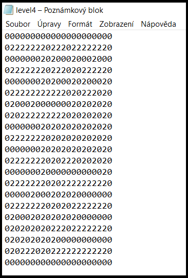
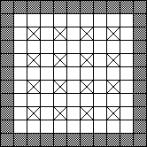

# Generování a procházení bludiště

Tento program v jazyce Python generuje bludiště, která následně umožní uživateli kompetitivní formou projít.

Pomocí prvního programu [Level_generator.py](Zapoctovy_program/Level_generator.py) bylo vygenerováno několik základních bludišť (levelů), které jsou uložené v adresáři [levels](Zapoctovy_program/levels) v jednotlivých souborech. Podstatná část tohoto programu byla také implementována do hlavního programu jako funkce, pomocí které se vygeneruje náhodné bludiště. S tímto programem může uživatel interagovat, pokud chce některý z levelů přegenerovat. 

Druhý program [main.py](Zapoctovy_program/main.py) je hra samotná, která umožní zahájit procházení předem vytvořených pěti levelů na čas. Zároveň si v hlavním programu může uživatel projít náhodně generované bludiště nebo si prohlédnout nejlepší časy z jednotlivých kol, popřípadě je resetovat. Tento program je interaktivní.

S hlavním programem uživatel komunikuje pomocí klávesnice. Jedná se především o pohyb v rámci menu a poté pohyb bludištěm. 

Na hru jako takovou je použita knihovna pygame.

## Použití

Pro spuštění hlavního programu spusťte [main.py](Zapoctovy_program/main.py). Jako první se zobrazí hlavní menu.

Vykreslení hlavního menu v kódu:

```python
def menu(choice): #menu hry, choice = cislo vyberu z menu
    ...
    
    vybrana_barva = (255,0,0) #cervena
    normalni_barva = (212,123,21) #oranzova
    
    if choice == 1:
        barva_v1 = vybrana_barva
        barva_v2 = barva_v3 = barva_v4 = normalni_barva
    elif choice == 2:
        barva_v2 = vybrana_barva
        barva_v1 = barva_v3 = barva_v4 = normalni_barva
    elif choice == 3:
        barva_v3 = vybrana_barva
        barva_v1 = barva_v2 = barva_v4 = normalni_barva
    else:
        barva_v4 = vybrana_barva
        barva_v2 = barva_v3 = barva_v1 = normalni_barva
        
    font_nadpis = pygame.font.Font("font/built_titling_bd.otf", 120)
    text_nadpis = font_nadpis.render('MazeGame',True,(212,123,21))
    textRect_n = text_nadpis.get_rect()
    textRect_n.center = (800 // 2, 600 // 2 - 155)
    
    font_volba = pygame.font.Font("font/built_titling_bd.otf", 70)
    text_volba1 = font_volba.render('normal game',True,barva_v1)
    textRect_v1 = text_volba1.get_rect()
    textRect_v1.center = (800 // 2, 600 // 2 - 40)
    
    text_volba2 = font_volba.render('random game',True,barva_v2)
    textRect_v2 = text_volba2.get_rect()
    textRect_v2.center = (800 // 2, 600 // 2 + 30)
    
    text_volba3 = font_volba.render('personal bests',True,barva_v3)
    textRect_v3 = text_volba3.get_rect()
    textRect_v3.center = (800 // 2, 600 // 2 + 100)
    
    text_volba4 = font_volba.render('exit',True,barva_v4)
    textRect_v4 = text_volba4.get_rect()
    textRect_v4.center = (800 // 2, 600 // 2 + 170)
    ...
        win.fill((0,0,0))
        win.blit(text_nadpis, textRect_n)
        win.blit(text_volba1, textRect_v1)
        win.blit(text_volba2, textRect_v2)
        win.blit(text_volba3, textRect_v3)
        win.blit(text_volba4, textRect_v4)
        pygame.display.update()
        ...
    ...

```

Výsledek:


Pro přegenerování některého z levelu spusťte [Level_generator.py](Zapoctovy_program/Level_generator.py). Do konzole zadejte celé číslo od 1 do 5 podle čísla levelu, který se má přegenerovat. Zadání jiného čísla nebo znaku způsobí vytvoření nového textového souboru, který se ovšem v hlavní hře neprojeví.

Uložení nově vygenerovaného bludiště v kódu:
```python
def uloz_bludiste(num):
    f = open(f"levels/level{num}.txt","wt")
    for radek in bludiste:
        for prvek in radek:    
            f.write(f"{prvek}")
        f.write("\n")
    f.close()
```

Výsledek uloženého bludiště v textovém souboru (pro zadané číslo 4):  


## Instalace a požadavky
Pro spuštění [main.py](Zapoctovy_program/main.py) je potřeba mít nainstalovanou knihovnu Pygame verze 1.9.6, pro spuštění [Level_generator.py](Zapoctovy_program/Level_generator.py) není třeba žádná nainstalovaná knihovna.

## Dokumentace

### Algoritmus použitý pro generování bludiště
Algoritmus, pomocí kterého se bludiště generuje, jsem zvolil tak, aby byl co nejpřehlednější a co nejlépe implementovatelný. Jedná se o algoritmus, který je popsaný v článku na webu [itnetwork.cz](https://www.itnetwork.cz/navrh/algoritmy/algoritmy-bludiste/algoritmus-tvorba-nahodneho-bludiste). Pro realizaci algoritmu budeme pořebovat reprezentovat 3 stavy políčka - nic = 0, základ = 1, zeď = 2. Na základě těchto hodnot pak vytvoříme základ pro tvorbu bludiště - okraje mají hodnotu 2, každé sudé políčko na sudém řádku (číslujeme od 0), kde není okraj, má hodnotu 1, ostatní políčka mají hodnotu 0.  
Stručně nastíněný algoritmus:
1. náhodně vybereme jeden ze základů (hodnota 1)
2. vybereme náhodně směr a od vybraného základu daným směrem stavíme zeď, dokud nenarazíme na jinou zeď (hodnota 2)
3. celý algoritmus opakujeme, dokud počet základů není 0  

  
Na animaci jsou zdi reprezentovány šedivými políčky, základy políčky s křížkem a volná políčka bílou barvou. (Obrázky, z kterých je vytvořená animace, jsou opět z webu [itnetwork.cz](https://www.itnetwork.cz/navrh/algoritmy/algoritmy-bludiste/algoritmus-tvorba-nahodneho-bludiste).

Implementace algoritmu v programu [main.py](Zapoctovy_program/main.py):
```python
def gen_maze(): #funkce generovani bludiste
    bludiste = []

    def template(): #0 = zed, 1 = zaklad, 2 = volno; vytvori planek pro tvorbu bludiste
        bludiste.append([0 for _ in range(21)])
        bludiste.append([0]+[2 for _ in range(19)]+[0])
        for _ in range(9):
            bludiste.append([0,2]+[ x for _ in range(9) for x in (1,2)]+[0])
            bludiste.append([0]+[2 for _ in range(19)]+[0])
        bludiste.append([0 for _ in range(21)])

    def uloz_bludiste():
        f = open("levels/random_level.txt","wt")
        for radek in bludiste:
            for prvek in radek:    
                f.write(f"{prvek}")
            f.write("\n")
        f.close()
     
    def kolik_zakladu(): #spocita, kolik je v planku zbylych zakladu
        pocet_zakladu = 0
        for radek in bludiste:
            for prvek in radek:
                if prvek == 1:
                    pocet_zakladu +=1
                else: pass
        return pocet_zakladu

    def vyber_nahodne_zaklad(): #nahodne vybere jeden ze zakladu
        poc_zakladu = 0
        poc_radku = 0
        index = random.randint(1,kolik_zakladu())
        #print(index)
        for radek in bludiste:
            poc_prvku = 0
            while poc_prvku !=21:
                if radek[poc_prvku] == 1:
                    poc_zakladu += 1
                    if poc_zakladu == index:
                        return (poc_radku, poc_prvku)
                poc_prvku += 1
            poc_radku += 1
        
    def postav_zed(): #z nahodne vybraneho zakladu stavi nahodnym smerem zed, dokud nenarazi na jinou zed
        souradnice = vyber_nahodne_zaklad()
        y, x = souradnice[0], souradnice[1]
        volba = random.randint(1,4) #1 = nahoru, 2 = dolu, 3 = vlevo, 4 = vpravo
        if volba == 1: #nahoru
            while bludiste[y][x] != 0:
                bludiste[y][x] = 0
                y -= 1
        elif volba == 2: #dolu
            while bludiste[y][x] != 0:
                bludiste[y][x] = 0
                y += 1
        elif volba == 3: #vlevo
            while bludiste[y][x] != 0:
                bludiste[y][x] = 0
                x -= 1
        else:            #vpravo
            while bludiste[y][x] != 0:
                bludiste[y][x] = 0
                x += 1

    def postav_bludiste(): #stavi zdi, dokud v planku jsou nejake zaklady
        template()
        while kolik_zakladu() != 0:
            postav_zed()
            
    postav_bludiste()
    uloz_bludiste()
```

